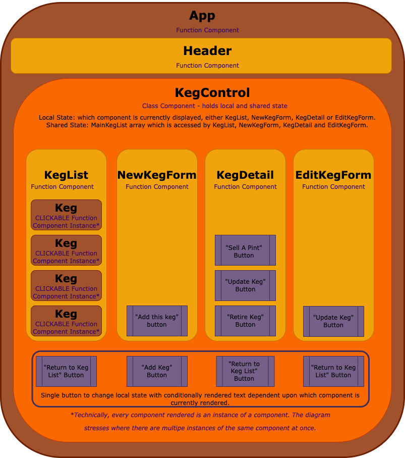

# _Tap Room_

#### _A React application with full CRUD capability for tracking the keg inventory of a fictional kombucha bar._

#### _By **Jessica R. Williams**_

#### _Table of Contents_

1. [Technologies Used](#technologies)
2. [Description](#description)
3. [Setup/Installation Requirements](#setup)
4. [React Component Diagram](#diagram)
5. [Known Bugs](#bugs)
6. [License](#license)
7. [Contact Information](#contact)

## Technologies Used 

* _npm 7.20.3_
* _React 17.0.2_
* _React Dom 17.0.2_
* _React Scripts 3.2.0_

## Description 

_A React application with full CRUD capability for tracking the keg inventory of a fictional kombucha bar. Create using create-react-app._

_The user may add, update, view details, and delete a keg. The user may also sell a pint from a keg, thus reducing the number of pints remaining in the keg._

## Setup/Installation Requirements 

* _Open the terminal on your local machine_
* _If [Node.js](https://nodejs.org/en/) and [Nope Package Manager (npm)](https://www.npmjs.com/) are not installed on your local device, follow the instructions [here](https://www.learnhowtoprogram.com/intermediate-javascript/getting-started-with-javascript/installing-node-js)_
* _Navigate to the directory inside of which you wish to house this project_
* _Clone this project with the following git command `$ git clone <https://github.com/jessicarubinwilliams/tap-room>`_
* _Navigate to the top level of the repository with the command `$ cd project`_
* _Recreate project environment and install required dependencies with terminal command `$ npm install`_
* _Create production environment with terminal command `$ npm run build`_
* _Open project in a development server in the browser of your choice with the command `$ npm run start`_

## React Component Diagram 

## Known Bugs 
* _No known bugs_

## License 
*[MIT](https://choosealicense.com/licenses/mit/)*

Copyright (c) **_2021 Jessica R. Williams_**

## Contact Information 
**_Jessica R. Williams [mailto](mailto:jessicarubinwilliams@gmail.com)_**